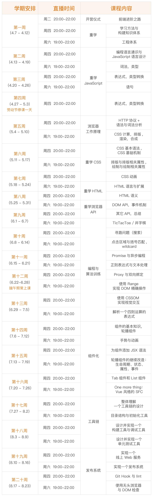

# 第0周

## 学习安排

直播时间：每周四 20:00-22:00、每周六 19:00-22:00 （有录播）

作业提交：每周三 23:59 前提交上周项目作业 & 学习总结

整体学习安排


## 自测题目

1、 编写一个 DOM 编辑器：可以自由地操作一个 iframe（空白）中的 DOM 结构，包括增、删、移动。

```
不懂
```

2、 讲讲 position float display 各有哪些取值，它们互相之间会如何影响？

```css
position: static | relative | absolute | sticky | fixed

float: left | right | none | inline-start | inline-end

display: [ <display-outside> || <display-inside> ] | <display-listitem> | <display-internal> | <display-box> | <display-legacy>

display-outsite :: block | inline
display-insite :: flow | flow-root | table | flex | grid | ruby
```

3、 JavaScript 启动后，内存中有多少个对象？如何用代码来获得这些信息？

```js
// 查看Global Object有多少个对象
Object.keys(this).filter((key) => {
  return typeof this[key] === 'object' && this[key] instanceof Object
})

```

4、 HTML 的中，如何写一个值为 “a”=‘b’ 的属性值？

```html
<html>
  <head></head>
  <body>
    <!-- “a”=‘b’  -->
    <div data-test="&#8220;a&#8221;=&#8216;b&#8217;"></div>
  </body>
</html>
```

5、 编写一个快速排序代码，并且用动画演示它的过程。

```
不懂
```
