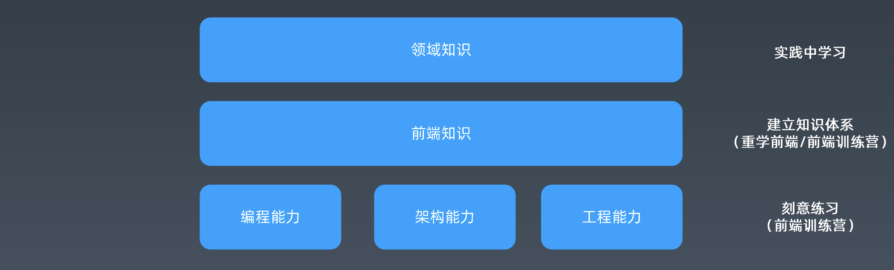
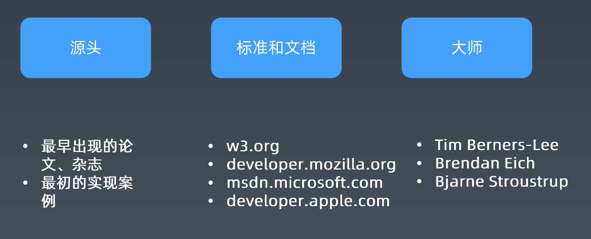
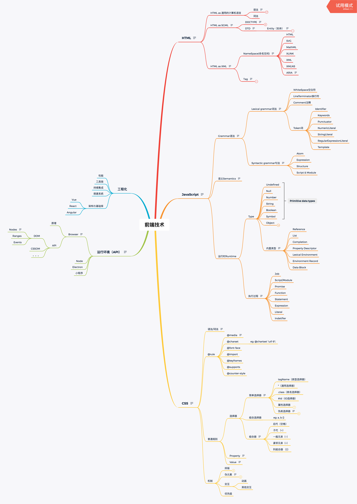

# 每周总结

## 1、学习方法

### 前端技能模型

* 编程能力：包括算法相关，编程语言运用等；解决难的问题，可以通过刷题提升。
* 架构能力：解决大的问题，可通过参与开源项目，看开源项目（带着目的性去看，如解决个issue）提升。
* 工程能力：解决人（协作）的问题。
* 前端知识：前端的通用知识，如js/html/css
* 领域知识：与你工作的业务领域有关。

刻意学习，不断学习，找机会学习，学习不一定是会用到，主要是为了学习，忘了也无所谓，用到/遇到再重新抓一遍。**学习本身就是痛苦的**

### 学习方法-整理法

在知识建建立联系关系

4种关系类型：顺序关系， 组合关系， 纬度关系， 分类关系

何为知识完备性，就是构建的知识体系内没有未覆盖到的知识，就成为完备了。

### 学习方法-追溯法

当查询的资料之间存在冲突，可以通过追溯的方式，去找最初的源头，这里的过程不是追寻本质，最终答案，是为了理解背后的东西，演变。

线索

### 面试题&面试

职业规划

总的规划 技术/管理

自己想要往哪个方向发展，可以参考市场招聘情况的，毕竟也是要挣钱生存的

## 2、构建知识体系

知识点

* [DOCTYPE and DTD](./DOCTYPE-and-DTD.md)
* [ARIA](https://www.w3.org/TR/html-aria/)
* [CSS](https://www.w3.org/TR/CSS)
* [HTML Living Standard](https://html.spec.whatwg.org/multipage/)
* [ecma262 ECMAScript Language Specification](https://tc39.es/ecma262/)

## 3、工程体系

### winter眼中的优秀前端工程师

* 领域知识
* 能力、潜力 （潜力影响技术高度，基础越扎实潜力越大）
* 有明确的职业规划，有目标有执行力 （工程师 --> 资深工程师 --> 专家 --> 经理）

如何让别人知道你是否优秀，通过你的成就展现。
简历的内容，成就用事实，数据陈述。

share自己的知识，广为流传就成为你的优秀成就了。

### 职业规划

you are the owner of your career.

在公司踏踏实实干活，其实对你的发展不大，更多的是你要主动出击，如参与开源项目，参加培训等等，对你有更大的发展。确定自己的路线，主动承担具有挑战性的工作，如果在公司没有条件实现，那你可能得换条路。

### 职业发展

成长 --> 成就 --> 晋升 --> 成长

良性循环，认真思考下自己在哪一角卡住，然后解决它，各种方法，让它能顺利循环

成就可以分三类：

* 业务型成就
* 技术型成就
* 工程型成就

#### 业务型成就

要取得业务型目标，重中之重搞清楚公司的业务目标，赚钱的方向。如果你在公司的工作不理解业务，其实你很难取得业务型成就。

取得业务型成就的方法论，通过方法论持续取得业务成就

* 业务目标
* 技术方案
* 实施方案
* 结果评估

**案例**--应用手势

业务目标&指标：点击率  
技术方案：给tab组件增加手势操作  
实施一：在业务中加入对应功能，并上线  
结果：点击率提升3倍  
实施二：编写通用tab组件，向所有导购业务推广，形成制度
结果+：推广到所有导购业务，符合预期。  

*不要局限自己的岗位、角色。*

#### 技术难题

方法论

目标： 公认的技术难点  
方案与实施： 依靠扎实的编程能力、架构能力形成解决方案  
结果： 问题解决  

先有问题，才能解决问题。

**案例**--爬取商品价格

背景：在某浏览器插件项目中，需要爬取各个网站价格比价，但是各个网站会采用图片价格等手段防御。  
方案：引入JS端的数字识别技术，靠AI技术极倔  
实施：直接上线  
结果：成功采集到信息  

_解决技术难题前提还是你得有扎实的编程能力、架构能力_。

#### 工程型成就

相对容易实现，毕竟是前端工程师

方法论：

目标：质量、效率  
方案与实施：规章制度、库、工具、系统  
结果：线上监控  

**案例**--XSS攻击的预防

目标&指标：XSS攻击白帽子反馈漏洞  
技术方案：整理安全手册，review历史代码，代码扫描工具  
实施：对全体前端宣讲，整体review代码，更改代码发布流程  
结果：XSS漏洞大幅减少  

工程型成就是相对自由的，不局限实体，规章制度也是之一，只要是能对项目产生收益。

*你是否被淘汰和年龄无关，是和你的技术能力有关。*

*不要局限自己的思维，局限自己的工作。*

#### 数据驱动的思考方式

一个小故事：  
2013:性能提升一倍  
2014:性能提升一倍  
2015:性能提升一倍  

3年提升8倍？不对劲。其实性能提升完后，随着需求发展，性能又退化了。若晋升P7来说是不及格的

数据驱动的思考方式

1. 目标：分析业务目标，定数据指标。目标可以是不明确的，得转换成具体的数据指标。并且要将目标和公司公认的核心指标关联上。
  如：提高用户活跃度，用户活跃度 = 日活/月活
2. 现状：采集数据，简历数据展示系统
3. 方案：设计技术方案，预估数据
  方案的实施通常不是自己的事情，更多是多个团队配合完成的，所以得拿出方案预估的数据去说服他们。
4. 实施：小规模实验，推广全公司落地形成制度
5. 结果：统计最终效果，汇报
  跟老板/领导汇报是非常重要且平常的事情，不局限于正式的，日常的。很多时候你不汇报工作情况，等于白做的。很多时候是自己不敢去汇报，领导通常是挺闲的，大胆去找他/预约汇报。如果老板不听你的汇报，说你的目标不对的。不越级汇报。
  返回第一步循环

说你踏实能干不是一件好事，说你技术好，业务明感度高才是认可你。对业务一窍不通不是个好的工程师，不要给自己设限。

很多时候公司要加班，其实就是老板发现公司的核心指标没有增长，不知怎办就想到各种奇葩招式如加班。

#### 工具链

* 工具链的作用
* 工具链的分类
  * 脚手架（创建通用项目模版）
  * 本地调试
  * 单元测试
  * 发布

  对应工具链4阶段：
  init->run->test->publish

* 工具链体系的设计
  * 版本问题（保证所有项目/工程的版本一致，有保持最新版本的，也有固定某版本的）
  * 数据统计（研发阶段的数据统计，如引用的组件，运行的命令等等）

优秀的工具链可以参考三大框架

#### 持续集成

客户端软件持续集成
> Daily build（每天构建一次）  
> BVT（Build Verification Test，通常是自动化测试的，由测试工程师提供）  

前端持续集成（前端的特点，页面间自然解耦）
> Check-in build  
> Lint + Rule Check  

前端项目是解释性的，构建很快，可以频繁构建；然后前端的需求变动也快，BVT不适合用，改为
Lint 加 Rule Check

Lint 如 ESLint

Rule Check

* 图片限制，单张不得大于50k，整包不得大于200k，UI给大图我们可以自己压缩，不要局限自己的工作内容。
压图如何不模糊。
* 无头浏览器 puppeteer，phantomjs

#### 技术架构

客户端架构：解决软件需求规模带来的复杂性（将前端当成客户端使用的，如web版word）  
服务端架构：解决大量用户访问带来的复杂性  
前端架构：解决大量页面需求带来的重复劳动问题  

如何解决：技术架构

* 库：有复用价值的代码
  * URL（URL标准：[rfc3986](https://tools.ietf.org/html/rfc3986)）
  * AJAX (标准的ajax,axios在实际项目中是不能直接用的，需要将通用的header，拦截器等等封装成库)
  * ENV（navigator，浏览器环境）

* 组件：UI上多次出现的元素
  * 轮播
  * Tab

  ===》 组件化的定义和基础设计，就是**组件化方案**。

* 模块：经常被使用的**业务**区块
  * 登录

#### 问答

* 数据结构
  > 常用数据结构：数据表，二叉树。有关数据结构，在开发中，80%是排序，数据也是大部分可hash，通过hash排序；不能hash的情况，用二叉树也基本满足
* LeetCode刷题
  > leetCode的题目很多是不用深究实用性的，刷题是锻炼你的思维能力。
* 关于设计模式
  > 不刻意追求，开发中感觉不到就用不到，感觉到了也就说明可以去学习。
* 通读一本书好难啃
  > 不要抱着读完整本书的态度去读，不是为读而读。带着目的去读，找你想要的部分就好了。
* 知识体系构建后，还要如何学习，全部深究吗？
  > 构建完后，哪里不会学哪里。同样，你觉得哪里重要，哪里想学就深究哪里。
* 如何提高代码质量
  > 一是多写代码；而是多参与开源项目，看别人的代码。
* 如何读源码
  >1、帮写文档，解决文档issue；2、fix bug；3、想要了解哪部份，就在那打上断点，单步追踪；4、pr
* 招聘职位中的年限，条件问题？
  > 都是虚的，只要能力达到，用成就证明就可以了，甚至巴不得你越年轻越好。
* 面试拒绝问题。
  > HR是负责招人的，拒绝通常是line manager拒绝你，借HR口说出而已。

## 4、作业

### 本周作业

* 在2. 重学 | 构建知识体系这节课上，老师所列的知识体系的脑图，自己根据老师所教授的追溯法，并通过理解将其补充完整，形成自己的知识体系。

  > [前端技术.xmind](./前端技术.xmind)

### 随堂作业

* 把课上老师的脑图里的这些实体补全

  > [DOCTYPE and DTD](./DOCTYPE-and-DTD.md)

* 你能不能在 ECMA 中找到所有的类型（Type）

  > Types: Null, Undefined, Boolean, Number, String, Symbol, Object
  >
  > Specification Types: Reference, List and Record, Set, Completion, Property Descriptor, Lexical Environment, Environment Record, Data Block

* URL解析

  > TODO

* 把面向对象这个概念用**追溯法**写一篇博文，写在自己的博客中，例如：博客园、稀土、掘金等，不限平台；你也可以写到 GitHub 的 Issues 里。把链接发到班级群里，跟大家分享。（不作为日常作业统计）

  > TODO

## 资料&网站

* [https://www.w3.org/](https://www.w3.org/)
* [http://w3school.com/](http://w3school.com/)
* [https://whatwg.org/](https://whatwg.org/)
* [https://scholar.google.com/](https://scholar.google.com/)
* [https://developer.mozilla.org/](https://developer.mozilla.org/)
* [https://docs.microsoft.com/](https://docs.microsoft.com/)
* [https://developer.apple.com/](https://developer.apple.com/)
