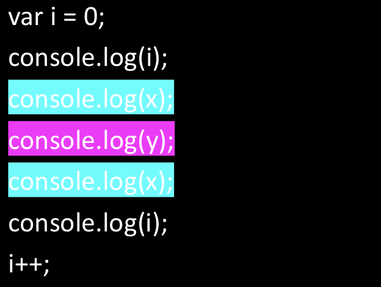
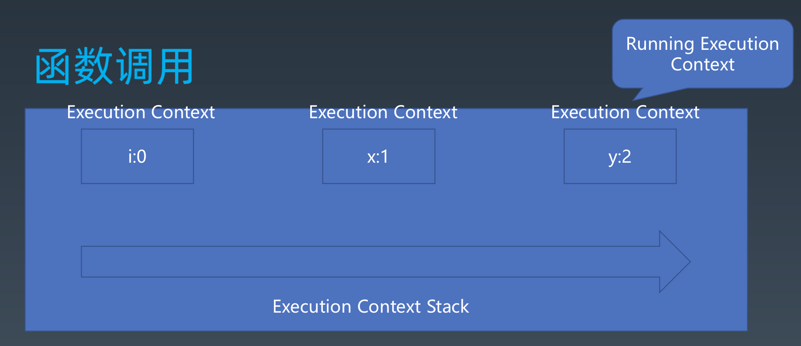
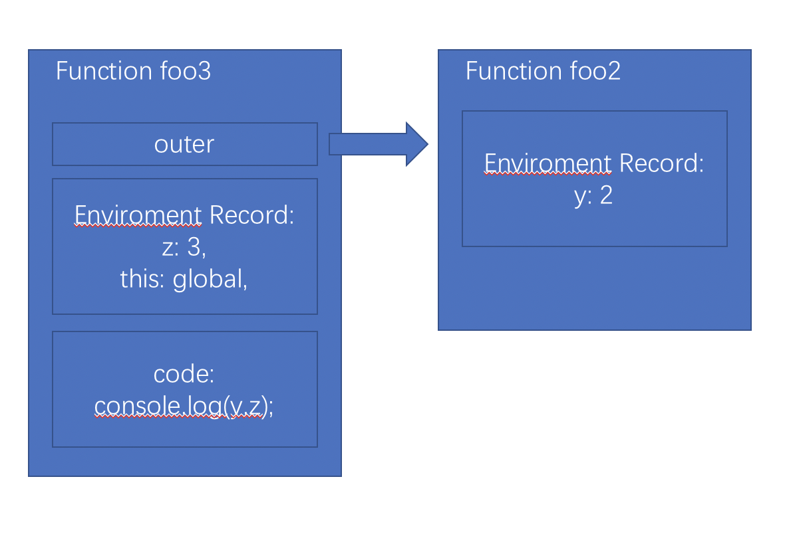

# 本周总结

## 结构化程序设计（Structure）

JS执行颗粒

* JS context（Realm）
* 宏任务（宿主环境）
* 微任务（promise）
* 函数调用（Execution Context）
* 语句/声明
* 表达式
* 直接量/变量/this ...


知识点：

1. Realm：
   1. 宿主环境每创建一个JS-context，就会产生一个Realm，Realm包含一系列固有对象。
   2. 在浏览器中产生一个Reaml的方式是创建一个iframe
2. 宏任务与微任务
3. 函数调用（Execution Context）
   1. 函数调用形成一个执行上下文
   2. 多个执行上下文形成执行栈

## 函数调用

举个例子：

```js
import {foo} from 'foo.js'

var i = 0
console.log(i)
foo()
console.log(i)
i++
```

```js
import {foo2} from 'foo2.js'

var x = 1
export function foo() {
  console.log(x)
  foo2()
  console.log(x)
}
```

```js
var y = 2

export function foo2() {
  console.log(y)
}
```

将调用的函数替换成语句，如下：  


语句中的颜色表示函数的调用/返回，`x`和`y`并没有申明，但可以正常访问，说明`x`和`y`是存在一个地方的，表示如下：

`i: 0` | `x: 1` | `y: 2`
---------|----------|---------
 var i = 0;<br>console.log(i);<br><br><br><br>console.log(i);<br>i++; | <br>console.log(x);<br><br>console.log(x);<br><br> | <br><br>console.log(y);<br><br><br>

每调用一个函数，就会创建并切换到对应的环境，函数执行完成后，退出该环境并销毁。这个其实就是执行上下文和执行栈。



调用一个函数，Execution Context Stack就会push进一个Execution Context；函数执行完成返回，Execution Context Stack就会pop出对应的Execution Context。

### Execution Context

执行上下文由以下部分组成：

* code evaluation state：主要用于async/await，记录函数执行状态
* Function：非函数创建的执行上下为null
* Reaml：一个JScontext对应一个Reaml，Reaml保存了一系列固有对象。
* ScriptOrModule：执行脚本或模块创建的，其他为null
* LexicalEnvironment：存变量的地方
* VariableEnvironment：历史包袱，仅用来存var变量申明的
* Generator：Generator函数才有的部分，（yield）

执行上下文分为两种：

* ECMAScript Code Execution Context
* Generator Code Execution Context（相比多了Generator）

### LexicalEnvironment

LexicalEnvironment组成部分：

* Environment Record
* outer Lexical Environment reference: 有可能为null

Environment Record组成部分：

* this
* new.target
* super
* 变量

LexicalEnvironment是一个链式结构，一个record和一个外部enviroment引用。不同的操作产生不同records

### VariableEnvironment

VariableEnvironment是个历史包袱，仅用来处理var声明。（VariableEnvironment是LexicalEnvironment的一种）

```js
{
  let y = 1;
  eval('var x = 1;')
}
with({a: 1}) {
  eval('var x;')
}
console.log(x)
// 执行到eval时，申明var变量，且var变量时函数级别的作用域，需要有VariableEnvironment由记录。

```

### Environment Record

Environment Record 类型：

* Declarative Environment Records
  * Function Environment Records
  * module Environment Records
* Globaal Environment Recordss
* Object Enviroment Records: with语句生成的
  * Object Environment Records created for with statements (13.11) can provide their binding object as an implicit this value for use in function calls.

不同的行为产生不同的records，当enviroment创建时存在上一级的LexicalEnvironment，outer会指向它。

### Function-Closure

所以在JavaScript中，执行上下文使得函数都是具有闭包的。
一个简单例子：

```js
var y = 2;
function foo2() {
  var z = 3
  return () => {
    console.log(y, z)
  }
}
var foo3 = foo2()
export foo3
```

对应enviroment record如下：



## 任务与任务队列

### 事件循环 EventLoop

事件循环和宏任务队列都是指同一个东西。

JavaScript本身没有事件循环的概念。事件循环在JavaScript引擎之外，是由浏览器，node.js等宿主环境实现的，是使用JavaScript代码的一种方式。

以OC的一段代码为例：

```objective-c
#import <Foundation/Foundation.h>
#import <JavaScriptCore/JavaScriptCore.h>

int main(int argc, const char * argv[]) {
    @autoreleasepool {
        // var context = new JSContext
        JSContext* context = [[JSContext alloc] init];
        JSValue* result;
        while (true) {

            char sourcecode[1024];

            scanf("%s", sourcecode);
            NSString* code = [NSString stringWithUTF8String:sourcecode];

            // context.evaluateScript('')
            result = [context evaluateScript:code];

            // console.log(result.toString());
            NSLog(@"%@", [result toString]);
        }
    }
    return 0;
}
```

`while(true)`就可以理解为事件循环（或者宏任务队列），不断等待输入一段JavaScript代码并执行。如果只是执行一次JavaScript代码，没必要有事件循环。

jscode执行方式有三种：

* script
* module
* function

### 宏任务与微任务

宏任务：宿主环境，JS本身无宏任务的概念  
  setTimeout，setIntervel，UI事件，script等，是由宿主环境提供的API，调用这类API会产生一个宏任务

微任务：JS环境，JS自身的任务队列（Job Queue）  
  promise产生的微任务，JS引擎自身将微任务入队；MutationObserver，产生一个微任务，但是入队的动作是由宿主环境操作的
  
一个宏任务由多个微任务组成，同步代码也是微任务，所有同步代码形成一个微任务，一个resolve/reject产生一个微任务(异步代码)。换个说法，JS代码就是（n个）微任务。

还是以OC的一段代码为例：

```objective-c
#import <Foundation/Foundation.h>
#import <JavaScriptCore/JavaScriptCore.h>

int main(int argc, const char * argv[]) {
    @autoreleasepool {
        // var context = new JSContext
        JSContext* context = [[JSContext alloc] init];
        JSValue* result;
        NSString* code = @"new Promise(resolve => resolve()).then(() => this.a = 3), function() {return this.a}";

        // context.evaluateScript('')
        result = [context evaluateScript:code];

        // [result callWithArguments:@[]];

        // console.log(result.toString());
        NSLog(@"%@", [[result callWithArguments:@[]] toString]);
    }
    return 0;
}
```

上面的代码中，`evaluateScript:code`产生一个宏任务，执行jscode，遇到promise产生一个微任务，然后执行`this.a = 3`，再返回一个函数。
OC接收到这个结果后，再执行这个函数，再产生一个宏任务，结果为`3`

再以一个例子捋一捋宏任务与微任务：

```js
async function afoo() {
  console.log('1')
  
  await new Promise(resolve => resolve())
  
  console.log('2')
}

new Promise(resolve => resolve()).then(() => {
  console.log('3')
}).finally(() => {
  console.log('5')
})

setTimeout(function () {
  console.log('6')

  new Promise(resolve => resolve()).then(() => {
    console.log('7')
  })
}, 0)

console.log('8')
afoo()

/**
 * 第一个宏任务：
 *  8,1
 *    入队3,2
 *  3
 *    入队5
 *  2
 *  5
 * 第二个宏任务：
 *  6
 *    入队7
 *  7
 */
```

> resolve => 将then的回调函数入队  
> reject => 将catch的回调函数入队
>
> then/catch回调执行完成后 => finally的回调入队
>
> await 可以理解在语句后面加上then

### 参考资料

* [Objective-C JavaScriptCore](https://developer.apple.com/documentation/javascriptcore)
  * [JSContext](https://developer.apple.com/documentation/javascriptcore/jscontext)
    * [evaluateScript](https://developer.apple.com/documentation/javascriptcore/jscontext/1451350-evaluatescript)
  * [JSValue](https://developer.apple.com/documentation/javascriptcore/jsvalue)
    * [call(withArguments:)](https://developer.apple.com/documentation/javascriptcore/jsvalue/1451648-call)

## Reaml

在JS中，函数表达式和对象直接量均会创建对象。

使用`.`做隐式转换也会创建对象。

这些对象也是有原型的，如果我们没有Reaml，就不知道他们是什么。

```js
// url: about:blank

var iframe = document.createElement('iframe')

document.body.appendChild(iframe)

iframe.contentWindow.eval('this.o = {}')

iframe.contentWindow.o instanceof Object // false

var o = iframe.contentWindow.o
var o2 = {}
Object.getPrototypeOf(o) === Object.prototype // fasle
Object.getPrototypeOf(o2) === Object.prototype // true
```
