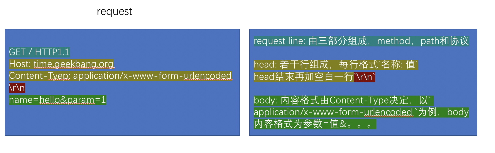
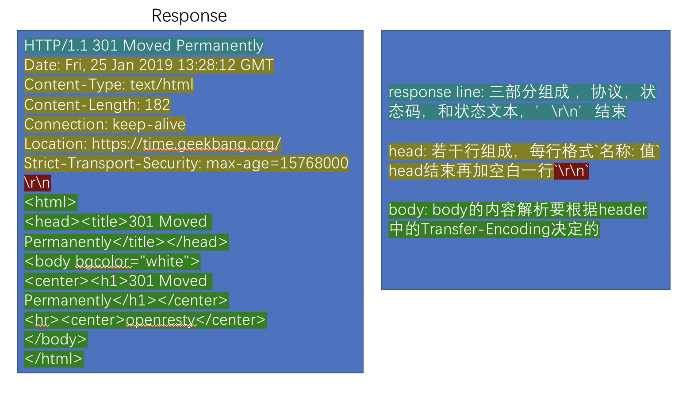

# 本周总结

## 浏览器

浏览器访问一个网页的过程

* URL
  * http
* HTML
  * parse
* DOM
  * css computing
* DOM with CSS
  * layout
* DOM with position
  * render
* Bitmap

## 网络模型

IOS-OSI七层网络模型| TCP/IP 四层网络模型 | 实例
---------|----------|----------
 应用 | 应用层 | HTTP（require('http')）
 表示 | |
 会话 | |
 传输 | 传输层| TCP、UDP (require('net'))
 网络 | 网络互联层| IP
 数据链路层 | 网络访问（链路）层| WIFI、5G
 物理层 | |

## TCP/IP

TCP

* 流
* 端口
* require('net')

IP

* 包
* IP地址
* libnet/libpcap

## HTTP

分类及组成

* request
  * request line
  * headers
  * body
* response
  * response line
  * headers
  * body

### method

* GET
* POST
* HEAD
* DELETE
* PUT
* OPTIONS

### status code and status text

* 1xx：临时回应，表示客户端请继续。
* 2xx：请求成功。
  * 200：请求成功。
* 3xx: 表示请求的目标有变化，希望客户端进一步处理。
  * 301&302：永久性与临时性跳转。
  * 304：跟客户端缓存没有更新。
* 4xx：客户端请求错误。
  * 403：无权限。
  * 404：表示请求的页面不存在。
  * 418：It’s a teapot. 这是一个彩蛋，来自 ietf 的一个愚人节玩笑。（超文本咖啡壶控制协议）
* 5xx：服务端请求错误。
  * 500：服务端错误。
  * 503：服务端暂时性错误，可以一会再试。

### header

### body

HTTP请求的body主要用于提交表单场景。实际上，HTTP请求的body是比较自由的，只要浏览器端
发起的body服务端认可就可以了。一些常见的body格式是：

* application/json
* application/x-www-form-urllencoded
* multipart/form-data
* text/html

我们使用HTML的form标签提交产生的HTML请求，默认会产生application/x-www-form-urlencoded
的数据格式，当有文件上传是，则会使用multipart/form-data

## 作业

1. 用 G6 antv 可视化 Realm 中的所有对象（选做）

> 见[realm.html](./realm.html)

1. 根据老师课上讲解，完成课堂上的代码

> 代码[server.js](./toy-browser/server.js)、[client.js](./toy-browser/client.js)