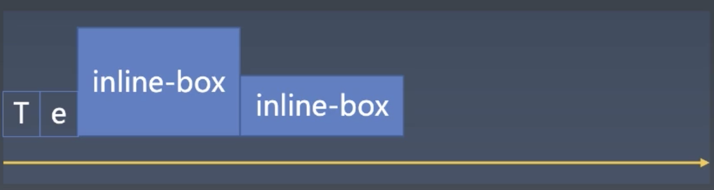
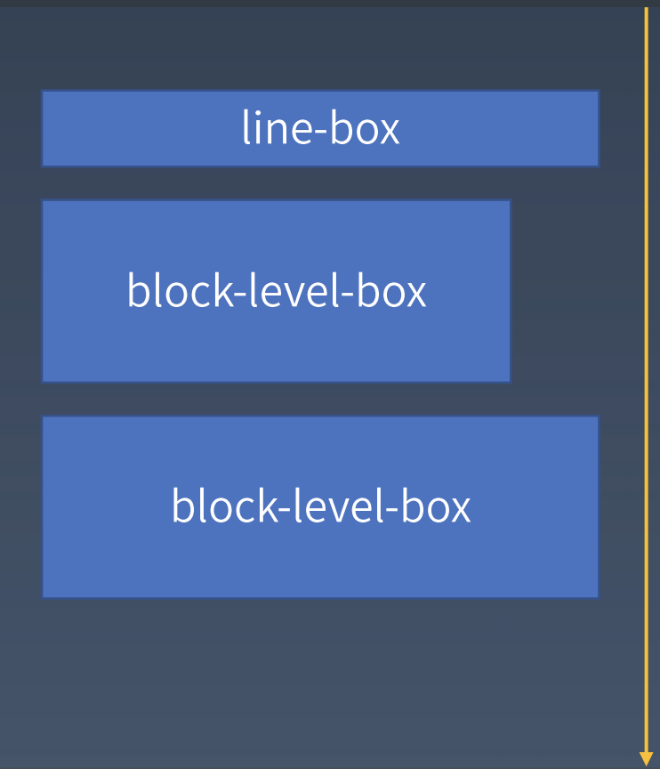

# 本周总结

## CSS选择器

### 选择器语法

* 简单选择器
  * `*` 通配
  * div svg|a(namespace|elementName，其实html下的css选择器都带命名空间，只不过省略了)
  * .cls
  * #id
  * [attr=value], [attr~=value], [attr|=value] ...
  * :hover
  * ::before
* 复合选择器
  * <简单选择器> <简单选择器> <简单选择器> （不带空格）
  * `*`或者 elementName 必须写在最前面
* 复杂选择器
  * <复合选择器> `<sp>` <复合选择器>：后代
  * <复合选择器> ">" <复合选择器>：父子
  * <复合选择器> "~" <复合选择器>：相邻兄弟选择器
  * <复合选择器> "+" <复合选择器>：通用兄弟选择器
  * <复合选择器> "||" <复合选择器>：[列合并](https://developer.mozilla.org/zh-CN/docs/Web/CSS/Column_combinator)

### 优先级specificity

[https://www.w3.org/TR/2018/WD-selectors-4-20181121/#specificity-rules](https://www.w3.org/TR/2018/WD-selectors-4-20181121/#specificity-rules)

[行内，id，class，标签]：0，1，2，3

0: 行内元素
1: #id，
2: class，属性，伪类
3: 伪元素，标签

通配选择器不累加优先级

特例：

* The specificity of an :is(), :not(), or :has() pseudo-class is replaced by the specificity of the most specific complex selector in its selector list argument.(渣翻，is，not，has的优先级以括号里的选择器去计算，自身不加优先级)
* Analogously, the specificity of an :nth-child() or :nth-last-child() selector is the specificity of the pseudo class itself (counting as one pseudo-class selector) plus the specificity of the most specific complex selector in its selector list argument (if any).(渣翻，自身优先级为伪类，加上括号内的选择器)
* The specificity of a :where() pseudo-class is replaced by zero.

* 作业
  * div#a.b .c[id=x]: [0, 1, 3, 1]
  * #a:not(#b): [0, 2, 0, 0]
  * *.a: [0, 0, 1, 0]
  * div.a: [0, 0, 1, 1]

### 伪类 pseudo-class

* 链接/行为
  * :any-link
  * :link, :visited (link表示没有访问过的超链接，visited表示访问过的超链接)
  * :hover （鼠标悬停，只能鼠标触发）
  * :active （对有交互行为的标签，）
  * :focus （焦点，tab）
  * :target

aria

* 树结构
  * :empty
  * :nth-child() 都是针对自身，相对父元素计算
  * :nth-last-child()
  * :first-child :last-child :only-child

computedCss 在startTag的时候计算

在startTag 中，nth-last-child,last-child,onlychild都是不能实现的

last-child, nth-last-child, only-child需要回溯

* 逻辑型
  * :not伪类
  * :where :has

### 伪元素 pseudo-elements

* ::before
* ::after
* ::first-letter：第一行的第一个字母
* ::first-line：排版第一行

```html
<div>
  <::before />
  content
  <::after />
</div>
```

思考🤔：

* 为什么first-litter可以设置float，而first-line不可以。

> 会脱离文档流，会自动选中剩下的第一行，出现无限循环吧。

first-line: 文字是逐字渲染的，和排版相关的内容，

first-line是css排版的概念，首个行盒，和HTML源码无关
first-letter是HTML源码中的第一个字母。

# 排版 layout

### 盒 Box

源代码 | 语义 | 表现
---------|----------|---------
 标签 | 元素 | 盒
 Tag | Element | Box

* HTML代码中可以书写开始**标签**，结束**标签**和自封闭**标签**。
* 一对起止**标签**表示一个**元素**。
* DOM树中存储的是**元素**和其他类型的节点（Node）。
* CSS选择器选中的是**元素**。
* CSS选择器选中的**元素**，在排版时可能产生多个**盒**。
  * inline换行产生多个盒。
  * ::before,::after产生多个盒。
  * 。。。
* 排版盒渲染的基本单位是**盒**

### 盒模型

margin - border - padding - content
外边距 - 边框 - 内边距 - 内容


box-sizing:

* content-box: width = content.width
* border-box: width = content.width + 2 `*` padding.width + 2 `*` border.width

### 正常流 normal flow

联想文字印刷排版

如何书写文字：

* 从左到右书写
* 同一行写的文字都是对齐的
* 一行写满了，就换到下一行

### 正常流排版

* 收集盒进行
* 计算盒在行中的排布
* 计算行的排布

<br>


* 从左往右 line-box(IFC)
  * text
  * inline-box
* 从上往下 block-container(BFC)
  * line-box
  * box-level-box

### 正常流的行模型line-box（IFC）

vertical-align规定了如何在垂直方向对齐盒


1. Vertical-align: baseline，是拿自己的 baseline 去对其行的 baseline
2. Vertical-align: top，middle，bottom，是拿自己的 ”顶部“ “中线” ”底部“ 去对其行的 ”顶部“ “中线” ”底部“
3. vertical-align: text-top，text-bottom，是拿自己的 ”顶部“ ”底部“ 去对齐行的 text-top 和 text-bottom

#### line box and inline-level box

内联格式化上下文由一个不包含block-level boxes的 block-container box建立的。
多个inline-lebel box组成的一行称为line box（行盒）。

当一个inline box的宽度超过一行的宽度，则会分割成多个line box。（除非是不可分割，这会导致inline box的宽度溢出line box。）

`Element.getClientRects()`

（相关：first-line）

### float and clear

（本质）文字绕排的一种方式，也是推荐这样使用

float使元素脱离正常流，float会导致重排

clear:right; 理解为找个干净的右边框浮动。

拓展：假设first-line允许float，那首行脱离文档流，第二行变成首行，又继续浮动，形成无限循环，所以fisst-line对float不生效

### margin折叠

margin折叠只发生在BFC（纵向），不同的BFC之间不会折叠

### overflow:visible和BFC

BFC的合并规则，容器为overflow:visible，里面能容纳正常流，且外面也是正常流，则会和外面的正常流合并。

其实除了overflow: visible，其他的block（能容纳正常流的）都会产生一个新的BFC

#### block-level element and black box

block-level box：表示可以被放入bfc  
block-container：表示可以容纳bfc  
block-box = block-level box + block-container  
block-box 如果 overflow 是 visible， 那么就跟父bfc合并  

资料：

* [BFC](https://www.w3.org/TR/2011/REC-CSS2-20110607/visuren.html#block-formatting)
* [collapsing-margins](https://www.w3.org/TR/2011/REC-CSS2-20110607/box.html#collapsing-margins)

#### display

display可分为 display-outside display-inside

相关值：

flex, inline-flex  
table, inline-table
grid, inline-grid
block, inline-block

inline

run-in

eg:
> inline-block:可以当两部分看，对外面的它的兄弟节点来说，他是一个inline元素，对它包含的元素来说，他是一个可以包含block的container，建立BFC。  
> display: block 理解为display:block-block。

block-level包含：flex、table、grid、block

### flex

### flex排版

* 收集盒进行
  * 根据主轴尺寸，把元素分进行
  * 若设置了nowrap，则强行分配到第一行
* 计算盒在主轴方向的排布
  * 找出所有Flex元素
  * 把主轴方向的剩余尺寸按比例分配给这些元素
  * 若剩余空间为负数，所有flex元素为0，等比压缩剩余元素
* 计算盒在交叉轴方向的排布
  * 根据每一行中最大元素尺寸计算行高
  * 根据行高flex-align和item-align,确定元素具体位置。

## 作业

* 编写一个 match 函数，完善你的 toy-browser

> [match.js](./match.js)
