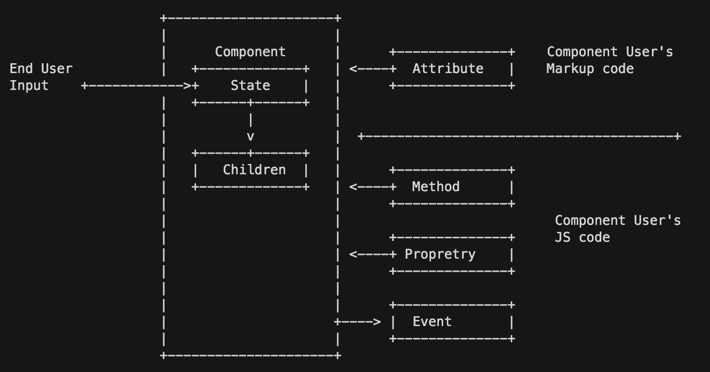
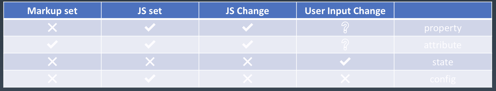
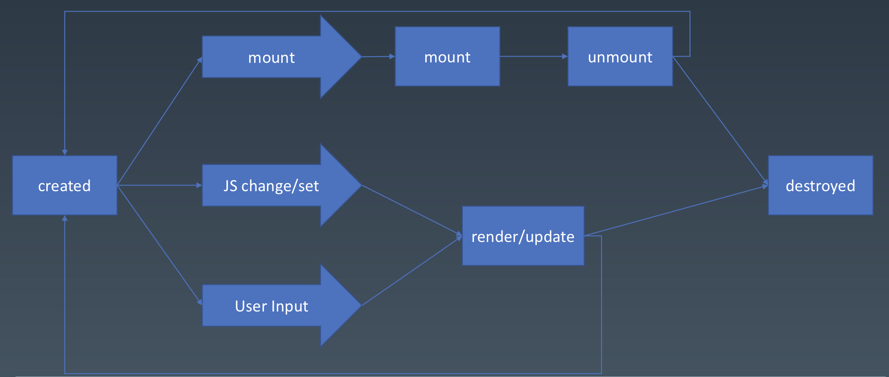

# 每周总结可以写在这里

## 编程与算法练习

### Proxy 与 双向绑定

reactive将对象变成响应式；effect会立即执行传入的函数，并响应式追踪依赖，依赖发生变化时重新执行。

* reactive: 基于Proxy劫持对象的get/set
  * get时表示在使用，触发收集依赖
  * set在改变值的同时，查看是否存在hander并执行
* effect: 过程式的收集依赖
  * 有全局存放收集到的依赖，在执行hander执行先清空
  * 执行handler
  * 执行完成后，处理收集到的依赖，将obj-prop和handler关联起来

### 使用 Range 实现 DOM 精确操作

#### 1、drag的实现

拖拽用到的事件：mousedown-mousemove-mouseup

1. 拖拽元素上监听`mousedown`事件，在回调函数内执行以下内容
2. 记录起始坐标（用clientX,clientY）
3. document上监听`mousemove`，取当前坐标和起始坐标的差值，然后进行平移`translate`
4. document上监听`mouseup`，记录结束坐标，用于下次拖拽时还原到原来的平移的位置，清空`mousemove`,`mouseup`的监听

### 拖拽元素插入文字内

重点：

* 基于range找出所有文字的间隙并存起来
* 根据拖动元素的坐标，找到最近的文字空隙位置，然后将元素插入进去
* 禁止`selectstart`事件


补充：

* [MouseEvent](https://developer.mozilla.org/en-US/docs/Web/API/MouseEvent)
  * clientX，clientY是基于该DOM的坐标

## 组件基础

### 对象与组件

对象
* Properties
* Method
* inhert

组件
* Properties
* Method
* inhert
* attribute
* config & state
* lifecycle
* event
* children

### Component



### Attribute and Property

*Attribute*: 强调描述性的

*Property*: 强调从属关系的（对象）

```
Attribute:
<my-component attribute="v" />
myComponent.getAttribute('a')
myComponent.setAttribute('a', 'v')

Property:
myComponent.a = 'value';
```

```html
<div class="cls1 cls2" style="color: blue;"></div>
<script>
  var div = document.getElementByTagName('div')[0]
  div.className // 'cls1 cls2'
  div.style // object
</script>
```

```html
<a href="//m.taoba.com">
<script>
  var a = document.getElementByTagName('a')[0]
  a.href // http://m.taobao.com 结果是resolve过的
  a.getAttribute('href') // '//m.taobao.com', 跟HTML中的代码一直
</script>
```

```html
<input value="cute" />
<script>
  var input = document.getElementsByTagName('input')[0]
  // 若property 没有设置，则结果是attribute
  input.value // cute
  input.getAttribute('value') // cute
  // 若value属性已经设置，则property变化，attribute不变，元素上实际的效果是 property 优先
  input.value = 'hello'
  input.value // hello
  input.getAttribute('value') // cute
</script>
```

### 如何设计组件状态



### Lifecycle



### Children

两种类型：Content型和Template型

```vue
<my-button>{{title}}</my-button>

<my-list>
  <li>{{title}}</li>
</my-list>
```

## 本周作业

* 完成 reactive 和 effect

  > 见[文件](./proxy/4.js)
  
* 看完课程《编程与算法训练 | 使用 Range 实现 DOM 精确操作》，完成本课编程训练代码

  > [drag](./drag-range/1.html)的实现；[元素插入文字](./drag-range/2.html)的实现